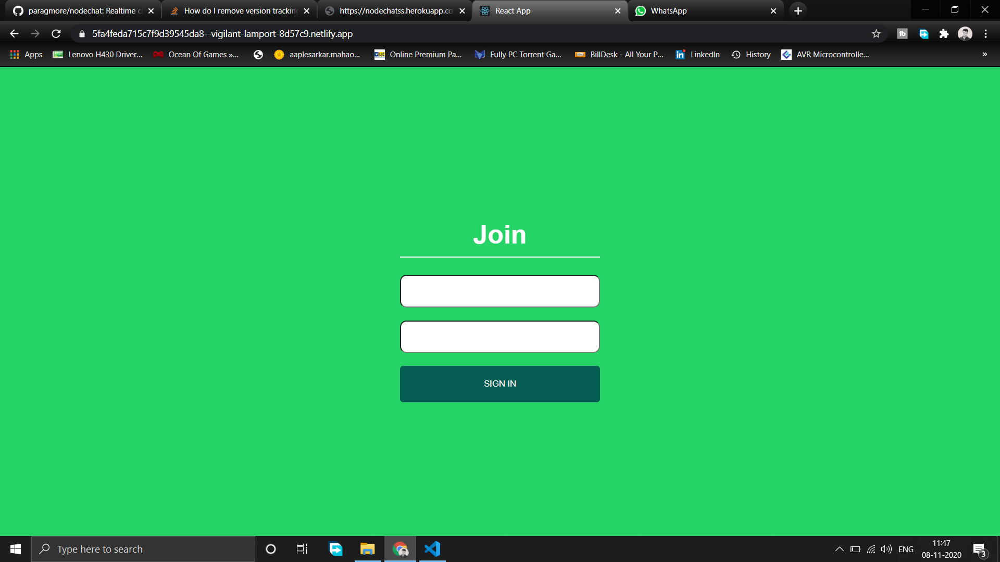

# nodechat

### Realtime chat app with node, socket.io, react

##### Chat app frontend Link 

<a>https://5fa4feda715c7f9d39545da8--vigilant-lamport-8d57c9.netlify.app/</a>

##### Server Link

<a>https://nodechatss.herokuapp.com/</a>

##### Screenshots

